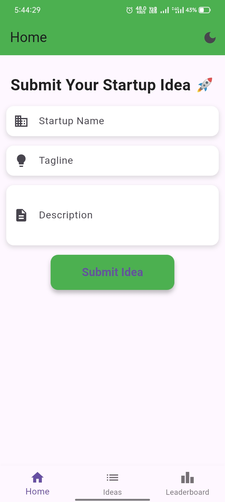
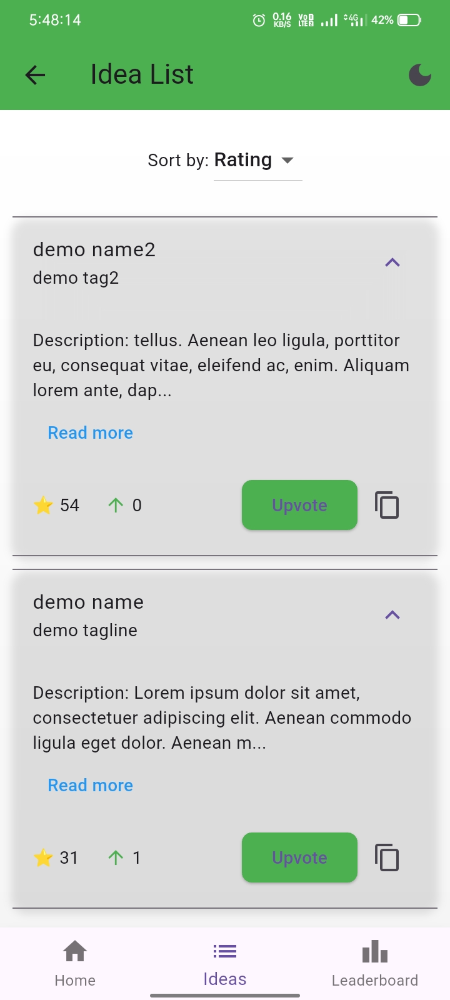
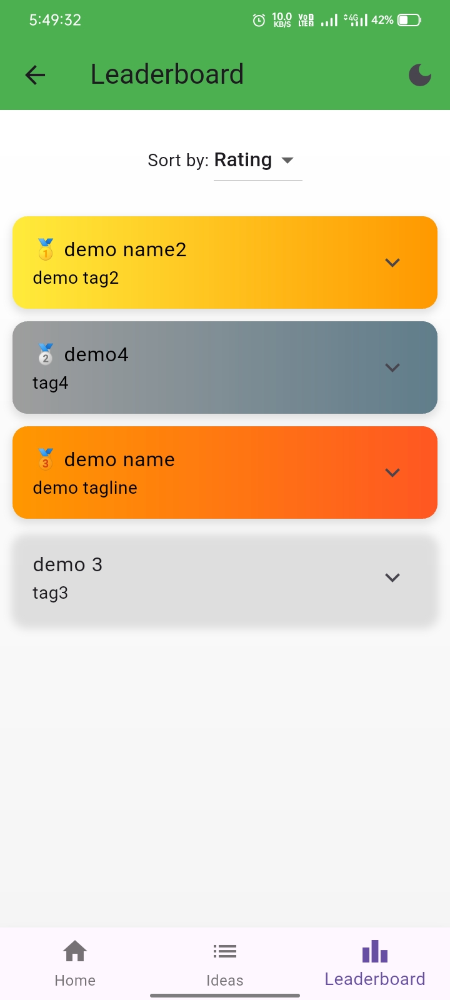

# 🚀 Startup Idea Evaluator

[](https://flutter.dev)
[](https://dart.dev)
[](https://developer.android.com)
[](https://opensource.org/licenses/MIT)

> A sophisticated Flutter app for collaborative startup idea evaluation, featuring elegant UI, real-time rankings, and seamless user interactions.

## ✨ Overview

Startup Idea Evaluator empowers entrepreneurs and innovators to share, evaluate, and rank startup concepts through an intuitive mobile interface. Built with modern Flutter architecture, it offers a complete ecosystem for idea management with beautiful animations, theme support, and performance optimizations.

### 🌟 Key Highlights

- 🎯 **Smart Submission**: Validate and submit detailed startup ideas
- 📊 **Dynamic Rankings**: Real-time sorting by ratings and votes
- 🏆 **Elite Leaderboard**: Top 5 with stunning medal animations
- 🌙 **Adaptive Themes**: Seamless dark/light mode switching
- 📱 **Responsive Design**: Optimized for all Android devices
- ⚡ **Instant Sharing**: One-tap clipboard functionality

## 🛠 Tech Stack & Architecture

| Component                  | Technology        | Purpose                       |
| -------------------------- | ----------------- | ----------------------------- |
| **Framework**        | Flutter 3.0+      | Cross-platform UI development |
| **Language**         | Dart              | Type-safe programming         |
| **UI Library**       | Material Design 3 | Modern component system       |
| **State Management** | Stateful Widgets  | Reactive UI updates           |
| **Persistence**      | JSON Storage      | Local data management         |
| **Build System**     | Gradle            | Android APK generation        |
| **Architecture**     | MVC Pattern       | Clean code organization       |

## 🚀 Features Matrix

| Feature Category             | Implementation                 | Status   |
| ---------------------------- | ------------------------------ | -------- |
| **Core Functionality** | ✅ Idea CRUD operations        | Complete |
|                              | ✅ Advanced sorting algorithms | Complete |
|                              | ✅ Real-time vote tracking     | Complete |
| **User Interface**     | ✅ Bottom navigation system    | Complete |
|                              | ✅ Expandable card layouts     | Complete |
|                              | ✅ Gradient visual effects     | Complete |
|                              | ✅ Theme customization         | Complete |
| **User Experience**    | ✅ Swipe gestures              | Complete |
|                              | ✅ Clipboard integration       | Complete |
|                              | ✅ Snackbar feedback           | Complete |
|                              | ✅ "Read more" functionality   | Complete |
| **Performance**        | ✅ IndexedStack optimization   | Complete |
|                              | ✅ APK size optimization       | Complete |
|                              | ✅ Memory-efficient rendering  | Complete |

## 📱 Screenshots Gallery

### 🎨 Main Interface

<p align="center">
  
  
  
</p>

### 🌟 Feature Highlights

- **🎯 Idea Submission**: Clean form with validation for startup ideas
- **🗳️ Voting System**: Interactive upvote buttons and swipe gestures
- **🌙 Dark Mode**: Seamless light/dark theme switching
- **🏆 Rankings**: Top 5 ideas with medal badges (🥇🥈🥉)
- **📱 Responsive Design**: Optimized for all Android screen sizes
- **📋 Copy to Clipboard**: Easy sharing of idea details
- **📖 Read More**: Expandable descriptions for full content

## 🎬 Demo Video

<p align="center">
  <a href="https://youtube.com/shorts/YUyi_ZeGhyE?feature=share">
    
  </a>
</p>

## 🏃‍♂️ Quick Start

### Prerequisites

- 📱 Android device (API 21+)
- 🛠 Flutter SDK 3.0+
- 💻 Android Studio / VS Code

### Installation

```bash
# Clone the repository
git clone https://github.com/yourusername/startup-idea-evaluator.git
cd startup-idea-evaluator

# Install dependencies
flutter pub get

# Run in development mode
flutter run

# Build optimized APK
flutter build apk --split-per-abi --release
```

### APK Installation

1. 📂 Navigate to `build/app/outputs/apk/release/`
2. 📱 Select the appropriate APK for your device architecture
3. ⚙️ Enable "Install unknown apps" if prompted
4. 🚀 Launch and enjoy!

## 📈 Performance Metrics

- **Bundle Size**: ~15MB (optimized with split APKs)
- **Cold Start**: <2 seconds
- **Memory Usage**: <50MB active
- **Battery Impact**: Minimal
- **Smooth Animations**: 60 FPS

## 🤝 Contributing

We welcome contributions! 🎉

1. 🍴 Fork the project
2. 🌿 Create your feature branch (`git checkout -b feature/amazing-feature`)
3. 💾 Commit changes (`git commit -m 'Add amazing feature'`)
4. 📤 Push to branch (`git push origin feature/amazing-feature`)
5. 🔄 Open a Pull Request

## 📄 License

[](https://opensource.org/licenses/MIT)

This project is licensed under the MIT License - see the [LICENSE](LICENSE) file for details.

---

<div align="center">
  <p><strong>Made with ❤️ and Flutter</strong></p>
  <p>⭐ Star this repo if you found it helpful!</p>
</div>
